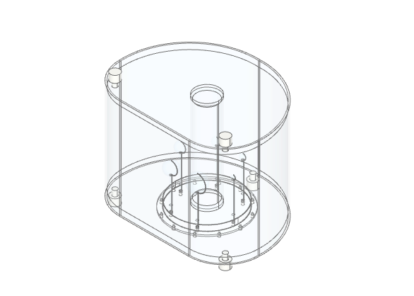

# CAD Phantoms

Parametric CAD models for medical imaging phantoms using [build123d](https://github.com/gumyr/build123d).

## Current Models



- **NEMA IEC Body Phantom** (`nema_wagi.py`) - IEC 61675-1 standard body phantom with:
  - Hollow spheres (10-37mm) with filling tubing
  - Lung insert
  - Mounting plate with screws
  - Material assignments via [pymat](https://github.com/MorePET/py-mat)

## Setup

### Prerequisites

- Python 3.12+
- [uv](https://github.com/astral-sh/uv) package manager
- VS Code with [OCP CAD Viewer](https://marketplace.visualstudio.com/items?itemName=bernhard-42.ocp-cad-viewer) extension

### Installation

```bash
git clone https://github.com/MorePET/cad-phantoms.git
cd cad-phantoms
uv sync
```

## Usage with VS Code + OCP CAD Viewer

### 1. Select Python Interpreter

1. Open the project in VS Code
2. Press `Cmd+Shift+P` (Mac) or `Ctrl+Shift+P` (Windows/Linux)
3. Type "Python: Select Interpreter"
4. Choose the `.venv` interpreter from this project (e.g., `./.venv/bin/python`)

### 2. Open the OCP Viewer

1. Press `Cmd+Shift+P` / `Ctrl+Shift+P`
2. Type "OCP CAD Viewer: Open Viewer"
3. A viewer panel will open (usually on the right side)

### 3. Run the Model

1. Open `nema_wagi.py`
2. Run the first cell (`#%%`) - this imports the libraries
   - VS Code will start a Jupyter kernel
   - Check the **terminal** for the viewer port (e.g., "Using port 3939")
3. Run subsequent cells to build the geometry
4. Each `show()` call updates the 3D viewer

### Tips

- **Run cells individually**: Click the "Run Cell" button or use `Shift+Enter`
- **Viewer not updating?**: Check the terminal for connection messages
- **Clipping planes**: Use `clip_slider_0/1/2` parameters in `show()` to cut through the model
- **Colors**: Set `clip_object_colors=True` to see material colors in cross-sections

## Project Structure

```
cad-phantoms/
├── nema_wagi.py          # NEMA IEC Body Phantom model
├── pyproject.toml        # Project dependencies
├── uv.lock               # Locked dependencies
└── *.step                # Exported CAD files (optional)
```

## Dependencies

- `build123d` - Parametric CAD modeling
- `ocp-vscode` - VS Code viewer integration
- `pymat` - Material library for CAD applications

## License

MIT

