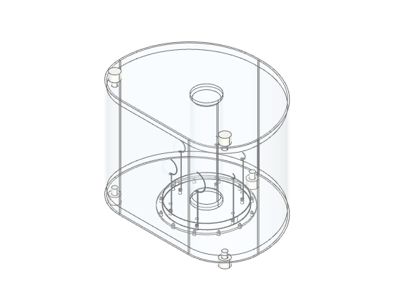

# CAD Phantoms

Parametric CAD models for medical imaging phantoms using [build123d](https://github.com/gumyr/build123d).

## Current Models



- **NEMA IEC Body Phantom** (`nema_wagi.py`) - IEC 61675-1 standard body phantom with:
  - Hollow spheres (10-37mm) with filling tubing
  - Lung insert
  - Mounting plate with screws
  - Material assignments via [pymat](https://github.com/MorePET/py-mat)

- **NEMA NU 2-2018 Scatter Phantom** (`nema_scatter.py`) - the count-rate phantom used for
  scatter fraction, count losses and NECR (NU 2-2018 section 4.3.2): Ø203 × 700 mm
  polyethylene cylinder with a 6.4 mm bore at 45 mm radial offset and a line source insert.

## Setup

### Prerequisites

- Python 3.12+
- [uv](https://github.com/astral-sh/uv) package manager
- VS Code with [OCP CAD Viewer](https://marketplace.visualstudio.com/items?itemName=bernhard-42.ocp-cad-viewer) extension

### Installation

```bash
git clone https://github.com/MorePET/cad-phantoms.git
cd cad-phantoms
uv sync
```

## Usage with VS Code + OCP CAD Viewer

### 1. Select Python Interpreter

1. Open the project in VS Code
2. Press `Cmd+Shift+P` (Mac) or `Ctrl+Shift+P` (Windows/Linux)
3. Type "Python: Select Interpreter"
4. Choose the `.venv` interpreter from this project (e.g., `./.venv/bin/python`)

### 2. Open the OCP Viewer

1. Press `Cmd+Shift+P` / `Ctrl+Shift+P`
2. Type "OCP CAD Viewer: Open Viewer"
3. A viewer panel will open (usually on the right side)

### 3. Run the Model

1. Open `nema_wagi.py`
2. Run the first cell (`#%%`) - this imports the libraries
   - VS Code will start a Jupyter kernel
   - Check the **terminal** for the viewer port (e.g., "Using port 3939")
3. Run subsequent cells to build the geometry
4. Each `show()` call updates the 3D viewer

### Tips

- **Run cells individually**: Click the "Run Cell" button or use `Shift+Enter`
- **Viewer not updating?**: Check the terminal for connection messages
- **Clipping planes**: Use `clip_slider_0/1/2` parameters in `show()` to cut through the model
- **Colors**: Set `clip_object_colors=True` to see material colors in cross-sections

## Headless / Container Workflow

The VS Code viewer flow above is for interactive modeling. For anything scripted -
exporting geometry for a simulation, or running the tests - use the container image
instead; it needs no display and no local Python environment.

```bash
podman build -t cad-phantoms:main -f Containerfile .

# run the test suite
podman run --rm -v "$PWD":/work -w /work cad-phantoms:main -m pytest -q

# export the phantoms
podman run --rm -v "$PWD":/work -w /work cad-phantoms:main export_phantoms.py --out build/
```

Building the body phantom takes ~30-60 s (it is a lot of geometry), so the tests build
each phantom once per session rather than once per test.

## World Frame Convention

Both phantom models are built in a natural CAD frame: millimetres, phantom axis along
+z. The simulation's world frame is different - the scanner axis is world **y** - so
`placement.py` maps every phantom from its CAD frame into the world frame before
anything is exported. The map is a proper +90° rotation about x, `(x, y, z)_cad ->
(x, -z, y)_world`, followed by a phantom-specific translation (e.g. `body_phantom_placement()`
puts the sphere plane at world y = 0, per NU 2-2018 section 7.3.3).

Because the export already happens in the world frame, the simulation configs that
consume it carry an identity rotation and translation - there is no frame conversion left
to get wrong, and the attenuation grid, source cloud and activity maps all come from one
rasterization instead of independently re-deriving the same transform.

## Exporting Phantoms for Simulation

`export_phantoms.py` writes one STEP/STL file per compartment, plus a `manifest.json`,
for a downstream voxelizer:

```bash
python3 export_phantoms.py --out build/ [--phantom nemaiq|nemasp|nemaabut|all] \
    [--formats step,stl] [--abut-end head|foot]
```

- `nemaiq` - the body phantom alone
- `nemasp` - the scatter phantom alone
- `nemaabut` - the body phantom plus the scatter phantom abutted at its head or foot end
  (NU 2-2018 section 7.3.3), in one compartment set

Output layout, per phantom, under `<out>/<phantom>/`:

```
<out>/<phantom>/
├── manifest.json          # frame, units, and per-compartment name/material/volume/bbox/files
├── <compartment>.step      # one STEP file per compartment, in mm, already in the world frame
└── <compartment>.stl       # one STL file per compartment
```

`build/` is scratch output and is not tracked.

## Project Structure

```
cad-phantoms/
├── nema_wagi.py           # NEMA IEC Body Phantom model
├── nema_scatter.py        # NEMA NU 2-2018 scatter phantom model
├── placement.py           # CAD-to-world-frame placement of both phantoms
├── export_phantoms.py     # CLI: export compartments (STEP/STL + manifest) for the voxelizer
├── tests/                 # pytest suite (run inside the container)
├── Containerfile          # headless build/test/export image
├── pyproject.toml         # Project dependencies
├── uv.lock                # Locked dependencies
└── *.step                 # Exported CAD files (optional)
```

## Dependencies

- `build123d` - Parametric CAD modeling
- `ocp-vscode` - VS Code viewer integration
- `pymat` - Material library for CAD applications

## License

MIT

